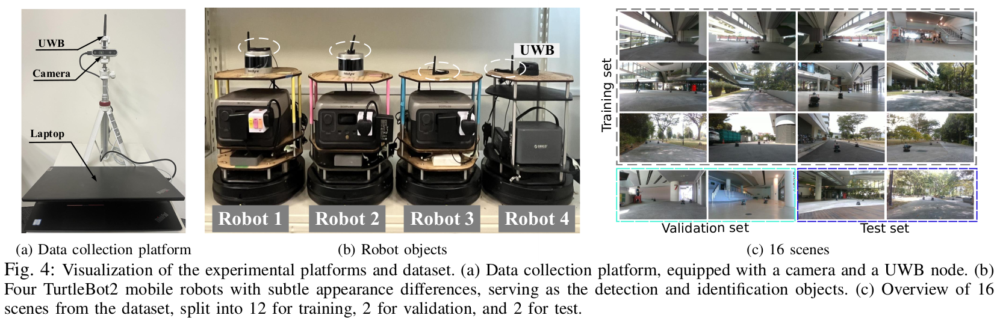

# 🤖 Homogeneous Multi-Robot Detection Dataset
This repository provides a UWB-assisted vision-based multi-robot detection dataset, where every annotated robot instance is synchronized with the corresponding UWB measurement, including both the robot-to-camera ranging measurement and the associated unique identity information. By combining visual observations with UWB measurements, the dataset enables research on multi-modal teammate robot perception for distributed multi-robot systems.
The dataset is motivated by a practical challenge in homogeneous multi-robot teams. Since robots are often built on identical platforms and exhibit only subtle visual differences, appearance-based object detectors frequently struggle to reliably detect and identify individual robots using visual cues alone. This problem becomes even more challenging when robots occupy only a few image pixels due to long observation distance or unfavorable viewing conditions.
To address this limitation, each annotated robot instance is paired with its corresponding UWB ranging and ID information. It provides explicit associated object-distance and identity cues, enabling instance-aware teammate robot perception.

We hope this dataset serves as a useful benchmark for advancing robust perception algorithms for real-world multi-robot applications.


## 📊 Contents
The dataset contains 2,028 RGB images collected across 16 scenarios, comprising a total of 7,673 annotated robot instances. It features four homogeneous TurtleBot2 robots as the detection and identification targets, with each robot assigned a unique identity and treated as a separate detection class. Every robot instance is annotated with a bounding box and synchronized with its corresponding UWB measurement, including the ranging and ID information. Since UWB provides only scalar ranging measurements, associating UWB sensor with camera does not require complex 3D camera–UWB spatial alignment or precise extrinsic calibration.





## 🏷️ Label Format
Each annotation follows the standard YOLO format and is extended with two additional fields: the corresponding UWB ranging measurement and associated ID. Consequently, each annotated robot instance includes its class label, normalized bounding box coordinates, synchronized UWB range, and identity information. Therefore, the dataset can be directly used with existing YOLO-based detection frameworks or extended to develop UWB-assisted multi-modal detection methods.
```
<class_id> <x_center> <y_center> <width> <height> <uwb_distance> <uwb_id>
```
* `x_center`, `y_center`, `width`, `height` — Normalized bounding box coordinates [0, 1], following the standard YOLO format.
* `uwb_distance` — Synchronized UWB ranging measurement (in meters) from the camera to the annotated robot instance.
* `uwb_id` — Unique UWB tag ID associated with the annotated robot instance, which is set consistent with class_id.

Example:
```
2 0.271671875 0.7156805555555555 0.08891406249999996 0.18879166666666675 3.234999895095825 2
```
> **Note:** standard YOLO tools expect 5 columns and may not read the extra fields. Keep only the first five columns to use this as a normal YOLO detection dataset.


## 📁 Structure
```
dataset/
├── train/
│     ├── images/     # RGB images
│     └── labels/     # one .txt per image (YOLO + UWB measurements)
├── valid/
|     ├── images/     # RGB images
|     └── labels/     # one .txt per image (YOLO + UWB measurements)
├── test/
      ├── images/     # RGB images
      └── labels/     # one .txt per image (YOLO + UWB measurements)
```

## 🚧 Status
This dataset is part of our paper, **"UWB-Assisted Instance-Aware Visual Perception for Small Homogeneous Multi-Robot Detection"**, currently being submitted to a journal for review. The full method, experiments, and citation details will be added once the paper is accepted. Until then, please treat the dataset as a preview accompanying the submission.

👤Contact: Cao Zhiqiang, caozhiqiang_sc@163.com / zhiqiang_cao@mymail.sutd.edu.sg
